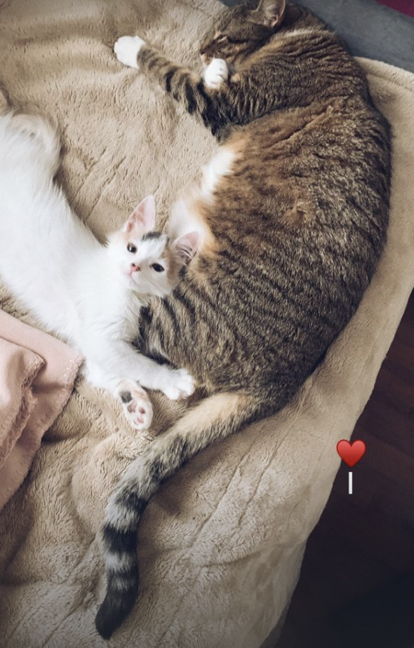

<!DOCTYPE html>
<html lang="en">
<head>
    <meta charset="UTF-8">
    <meta http-equiv="X-UA-Compatible" content="IE=edge">
    <meta name="viewport" content="width=device-width, initial-scale=1.0">
    <title>Bitácora de Camilla Carella</title>
    <link rel="stylesheet" href="css/style.css" media="all">
</head>

<body>
    <!-- Quiero centrar solo el texto del titulo, pero se centra toda la info de la pag 

 -->
    <h1> Bitácora Camilla Carella</h1>
    <h4>Hola me llamo Camilla Carella Rosenblitt y tengo 22, naci en Santiago y desde los 5 años viví en Valdivia, 
        luego en 2020 empecé a estudiar diseño y por la pandemia tuve clases online por 2 años, finalmente en 2022 estoy viviendo en Concon. 
        Un dato importante sobre mi esque tengo 2 gatitas llamadas Emma y Bianca, las amo demasiado eso bye.</h4>
    
        <h3> Clase viernes 19 de agosto</h3>
    <ul>
        <li>1. Aprendimos como agregar imagenes desde internet, sin ser necesario descargar la imagen, como vemos aqui abajo.</li>
                 
        <li>2. Para dejar una palabra en negrita debemos dejarla dentro de <*strong> aqui <*/strong> pero sin * como vemos en la frase de abajo
            de esta forma tambien estamos ANIDANDO otra etiqueta lo que quiere decir que una etiqueta tiene otra en su interior.</li>
        
 Mi gato es <strong>muy</strong> gruñon 

        <li>3. Para agregar parrafos de texto es necesario poner <*p> texto <*/p> como se ve indicado con texto falso abajo </li>

            Lorem ipsum dolor sit, amet consectetur adipisicing elit. 
            Ut reprehenderit consequuntur eligendi ratione repellendus eum unde eos atque eaque, 
            dolore corporis obcaecati quasi earum expedita. Mollitia, consequuntur! Possimus atque sit 
            repellat officiis maxime aperiam blanditiis mollitia commodi iusto officia recusandae, 
            mimagnam voluptatem? Quod nobis, sint atque quibusdam eum quam recusandae 
        <li>4. Para destacar una palabra y al hacer click te llece a un enace de otra pagina web es necesario 
            poner <*a href= "link pagina web"> Escuela (palabra que se preciona)<*/a>
        </li>
            <a href="https://www.ead.pucv.cl/"> Escuela </a>
        <li>5. Si queremos agregar una imagen que este en el computador tenemos que poner la carpeta donde se encuentra esta imagen y nos va ir mostrando las imagenes que
            se encuetras ahi, para luego seleccionar, tambien podemos determinar el tañamo con Widtg="cualquiera" </li> 
            
    </ul>

            

    <h3> Clase 26 de agosto</h3>
    <!--quiero lograr vincular esto al css y ver los colorer, pero no puedo -->
        
primero

        
segundo

        
tercero

        <em>cuarto</em>
        <em>quinto</em>
        <em>sexto</em>

    <h3> Clase 2 de septiembre</h3>

    <h3> Clase 9 de septiembre</h3>
        
    <h3> Sección de interés personal </h3>

    

 <footer> <h4>Contacto: </h4>
       Perfil wiki <a href="https://wiki.ead.pucv.cl/Camilla_Carella"> Mi wiki Camilla Carella </a>
        Mail personal: camiteresita@hotmail.com
        Mail institucional: camilla.carella.r@mail.pucv.cl
</footer>
   
</body>
</html>
